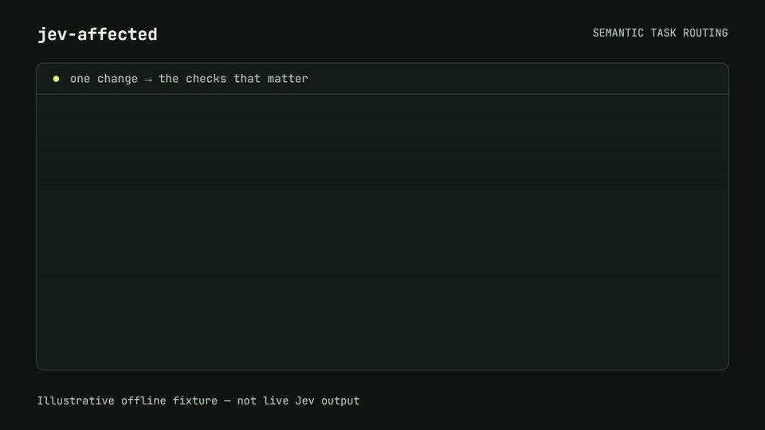
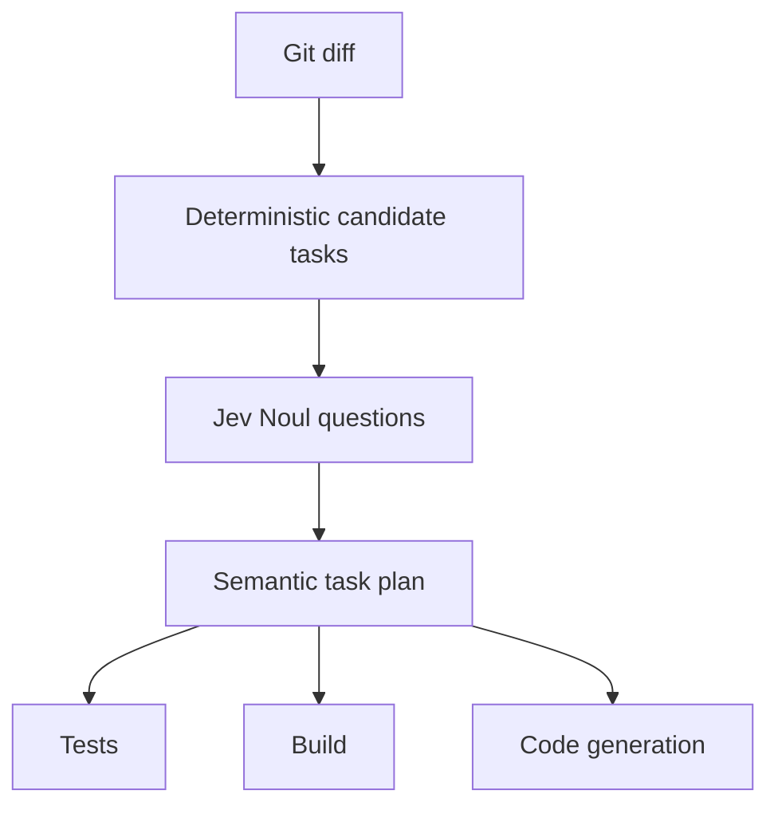

<p align="center"></p>

<p align="center"><strong>Semantic task routing for software development.</strong></p>
<p align="center">Run tasks based on what changed, not where it changed.</p>
<p align="center">v0.2.0 Public Beta · Node.js 20+ · TypeScript · MIT · Jev-powered</p>



Run the reproducible offline demonstration with `pnpm demo` after building. [MP4 version](assets/demo.mp4).

## What is jev-affected?

Define the conditions under which tasks matter in natural language. Jev evaluates those conditions against a Git diff. Code turns the probabilities into a safe, inspectable task plan for your existing test runner, build system, CI, or coding agent.

## Why?

A session lifetime change can affect login behavior without changing the public API. File dependencies alone do not express that distinction. Semantic conditions supplement your existing dependency graph.

## Quick start

```sh
pnpm add -D jev-affected
pnpm exec jev-affected init
```

With npm:

```sh
npm install -D jev-affected
npx jev-affected init
```

Set the API key in the process environment. The CLI does not read dotenv files or accept API keys in `jev-affected.yml`.

```powershell
$env:TYPESAFE_API_KEY = "your_api_key_here"
```

```sh
export TYPESAFE_API_KEY="your_api_key_here"
```

For persistent local use, configure the variable in your shell profile or operating-system credential environment. Open a new terminal after changing persistent environment variables. `TYPESAFEAI_API_KEY` is accepted as a compatibility fallback.

Configure your own trusted commands, commit your changes on a feature branch, then:

```sh
npx jev-affected inspect --base main
npx jev-affected plan --base main
npx jev-affected run --base main
```

`plan` performs analysis but never executes task commands. `run` executes configured commands. The default mode compares committed changes. Use `--working-tree` to include branch commits, staged changes, unstaged changes and untracked files, or `--staged` to analyze only the Git index.

```sh
npx jev-affected plan --working-tree --base main
npx jev-affected plan --staged
```

`--working-tree` accepts `--base` but not `--head`. `--staged` compares the index with `HEAD` and cannot be combined with `--base` or `--head`.

## How it works



Jev supplies `P(condition = true)`. A task is skipped only when its valid probability is **strictly below** `skipBelow`. Equality means RUN. No model-generated commands or explanations are used.

## Configuration

Only YAML is supported. Unknown keys and unsafe policies are rejected.

```yaml
version: 1
model: jev-latest
defaults:
  skipBelow: 0.10
policy:
  uncertain: run
  onError: run
analysis:
  maxDiffBytes: 100000
  timeoutMs: 10000
  exclude: ["**/*.pem", "**/*.key"]
execution:
  parallel: false
  concurrency: 4
tasks:
  auth-e2e:
    command: npm run test:auth
    when: Could authentication, sessions, cookies or login behavior change?
  sdk:
    command: npm run generate:sdk
    when: Could the public API contract change?
  typecheck:
    command: npm run typecheck
    always: true
```

`threshold` is a compatibility alias for `skipBelow`; specifying both in the same scope is an error. Task values override defaults. `allowSkip: false` protects a task just like `always: true`.

Optional task `include` globs select candidates; task `ignore` and global `ignore` remove matches. Both rename paths are checked. **These are hard dependency rules supplied by you**: overly narrow globs can miss required tasks. Protected tasks bypass them. See [examples/basic](examples/basic/jev-affected.yml).

## Safety

- Missing credentials, timeout, provider error, missing actual model version or invalid probability → RUN for semantic candidates.
- Sensitive file changes, unreadable/oversized patches, binary changes or submodules → RUN all tasks, with no semantic request.
- No matching changes → SKIP, except protected tasks.
- Task commands come exclusively from your configuration and run through your platform shell. Only run configurations you trust.

Low model probabilities are estimates, not a guarantee that a task is unnecessary. Use protected tasks for checks that must always run.

## CLI

| Command | Purpose |
| --- | --- |
| `init` | Create config without overwriting an existing file |
| `plan [--json]` | Produce a plan; never execute tasks |
| `run [--parallel] [--concurrency 4]` | Execute RUN tasks; sequential by default |
| `why <task>` | Show condition, probability, threshold, files and model |
| `inspect` | Preview sanitized analysis inputs locally; no request |
| `doctor` | Check Node, config, Git base, API key and models endpoint |
| `eval [--live]` | Evaluate fixture decisions and false-skip rate |

Common flags: `--base`, `--head`, `--working-tree`, `--staged`, `--config`, `--no-cache`, `--json`, `--help`, `--version`. JSON task output includes a stable `version: 1`. During `run --json`, child output goes to stderr, keeping stdout parseable.

Exit codes: `0` success; `1` failed executed task or failed evaluation gate; `2` config/argument/base or doctor check error; `3` internal/I/O failure. API failures do not fail a normal plan or run by themselves.

Base priority: CLI → config → GitHub PR base branch → `origin/main` → `main` → `master`. The comparison starts at the merge-base with head. Explicit invalid bases fail instead of silently choosing another branch. Fetch full history in CI.

## CI

```yaml
- uses: actions/checkout@v4
  with:
    fetch-depth: 0
- run: npx jev-affected run --base origin/main
  env:
    TYPESAFE_API_KEY: ${{ secrets.TYPESAFE_API_KEY }}
```

Install dependencies first. Do not expose credentials to untrusted PR code. Nx, Turbo and other runners can be invoked as configured commands; no plugins are required.

## Agents

Run `jev-affected plan --json --working-tree` while editing, or use the default committed mode after committing. Execute all tasks whose `decision` is `run`, or use `jev-affected run` with the same mode. `inspect` lets you review what could leave the repository first.

The package includes a reusable agent skill at [`skills/jev-affected`](skills/jev-affected). Point a compatible coding agent at that directory, or copy it into the agent's skills directory, to give it the safe planning and execution workflow.

## Architecture and library API

Modules separate configuration, Git collection, provider access, planning, execution and reporting. Jev is the only supported production provider. The provider interface supports offline test doubles.

```ts
import { loadConfig, createPlan } from 'jev-affected';
const config = await loadConfig('jev-affected.yml');
const plan = await createPlan({ config, base: 'main' });
```

Automatic caches store probabilities and model metadata in `.git/jev-affected/cache` (including Git worktree support). Keys include state, questions, configuration and pinned actual model version. Corrupt cache entries fall back to RUN. **Moving aliases such as `jev-latest` bypass caching**, because an alias cannot safely establish its current actual version without another request. Pin an actual `jev-x.y.z` version to enable reuse. Neither patches nor API keys are stored in cache payloads. Cache writes are the only local side effect of `plan`; `--no-cache` disables them.

## Evaluation

```sh
pnpm eval
pnpm eval:live
```

Seven fixtures cover session TTL, API fields, comments, logging, schema, performance and docs. Offline responses are **synthetic, not recorded model answers**. Zero false skips on those responses verifies decision plumbing, not Jev accuracy. Live evaluation fails unless it receives valid model answers, produces zero false skips, reduces tasks in at least two cases, and achieves at least 25% task reduction. It prints the actual model, task probabilities, latency and token usage. Cost is `null` because no pricing assumptions are embedded.

See [EVALUATION.md](EVALUATION.md) for the methodology, release gates, latest live result and limitations.

## Privacy

No backend and no telemetry. Data is read locally; semantic inputs go directly to TypeSafe through its SDK. API keys are read from the process environment only. By default, `.env*`, PEM/key files, and names containing `credentials`, `secret` or `token` are withheld. Custom exclusions add to these defaults. Filename exclusions cannot find every secret embedded in arbitrary source files: inspect inputs and use appropriate repository practices. SDK logging is explicitly disabled.

`TYPESAFE_BASE_URL` is honored by the official SDK; inspect this environment setting before use. Review [TypeSafe's data-processing terms](https://typesafe.ai/legal/mca) for your organization.

## FAQ

**Does this replace my build system?** No. It produces a plan and invokes your commands.

**Does `why` generate an explanation?** No. It displays decision evidence. With a moving model alias it can make a fresh request; it is not a historical plan lookup.

**What if Jev is down?** Candidate tasks run. Deterministic rules and protected tasks still apply.

**Are uncommitted files included?** Only with `--working-tree` or `--staged`. Default mode compares commits so explicit refs remain reproducible.

## Roadmap

The current release focuses on inspectable semantic dependencies and safe plans for committed, working-tree and staged changes. Later candidates include historical evaluations, watch mode, task groups and Nx/Turbo adapters. No GUI, SaaS, MCP server or autonomous command generation is included.

## Contributing and license

See [CONTRIBUTING.md](CONTRIBUTING.md), [SECURITY.md](SECURITY.md), and the [MIT LICENSE](LICENSE).

jev-affected is an independent open-source project and is not affiliated with or endorsed by TypeSafe AI.
